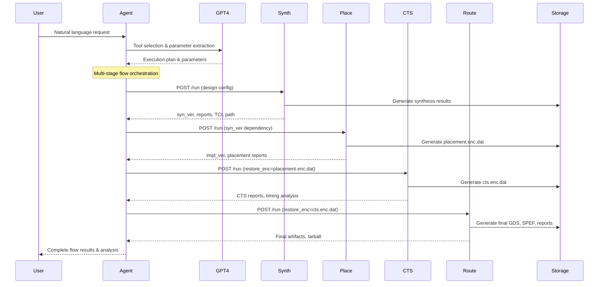

# MCP-EDA: AI-Driven Electronic Design Automation Platform

[](https://www.python.org/downloads/)
[](https://fastapi.tiangolo.com/)
[](https://openai.com/)

A production-grade, microservice-based Electronic Design Automation (EDA) platform that transforms natural language instructions into complete RTL-to-GDSII flows. Built with AI-powered orchestration and commercial EDA tool integration.

---


## Overview

MCP-EDA revolutionizes chip design workflows by providing:

- **AI-Powered Orchestration**: GPT-4 driven intelligent agent that understands natural language design requirements
- **Microservice Architecture**: Four independent, stateless FastAPI services for complete EDA flow
- **Template-Driven TCL Generation**: Automated script generation from modular templates
- **Session-Aware Workflows**: Context preservation across multi-stage design flows
- **Research Framework**: Built-in experiment and evaluation capabilities with CodeBLEU metrics

---

## System Architecture

```
┌─────────────────┐    ┌─────────────────┐    ┌─────────────────┐
│   User Query    │───▶│  MCP Agent      │───▶│   MCP Servers   │
│  (Natural Lang) │    │  Client (8000)  │    │    Executor     │
└─────────────────┘    └─────────────────┘    └─────────────────┘
                                │                       │
                                ▼                       ▼
                       ┌─────────────────┐    ┌─────────────────┐
                       │   OpenAI LLM    │    │    EDA Tools    │
                       │  (Tool Select)  │    │   (DC/Innovus)  │
                       └─────────────────┘    └─────────────────┘
```

### Service Architecture Details

| Service | Port | Purpose | Key Features |
|---------|------|---------|--------------|
| **Intelligent Agent** | 8000 | AI orchestration & workflow management | GPT-4 integration, session management, conflict detection |
| **Synthesis Service** | 13333 | RTL-to-gate synthesis | Template-driven TCL, Design Compiler integration |
| **Unified Placement** | 13340 | Floorplan + Powerplan + Placement | Multi-stage unified flow, workspace management |
| **CTS Service** | 13338 | Clock tree synthesis | Post-placement optimization, timing-driven CTS |
| **Route & Save** | 13341 | Global/detail routing + final save | Complete backend flow, artifact generation |

### Data Flow Architecture



---

## Key Features

### AI-Powered Workflow Management
- **Natural Language Processing**: Convert design requirements to EDA parameters
- **Intelligent Tool Selection**: Automatic flow stage determination
- **Conflict Detection**: Identify and resolve parameter conflicts
- **Strategy Optimization**: Performance, power, area, and speed optimization strategies

### Microservice Benefits
- **Independent Scaling**: Each service scales independently
- **Fault Isolation**: Service failures don't affect the entire flow
- **Technology Agnostic**: Easy integration with different EDA tools
- **Development Flexibility**: Teams can work on services independently

### Template System
```
scripts/FreePDK45/
├── tech.tcl                 # Technology configuration
├── frontend/                # Synthesis templates
│   ├── 1_setup.tcl
│   └── 2_synthesis.tcl
└── backend/                 # Physical design templates
    ├── 1_setup.tcl          # Environment setup
    ├── 2_floorplan.tcl      # Die planning
    ├── 3_powerplan.tcl      # Power grid
    ├── 4_place.tcl          # Placement
    ├── 5_cts.tcl            # Clock tree synthesis
    ├── 6_add_filler.tcl     # Filler cell insertion
    ├── 7_route.tcl          # Routing
    └── 8_save_design.tcl    # Final save
```

### Session Management
- **Context Preservation**: Remember previous parameters and preferences
- **Parameter Inheritance**: Smart parameter reuse across flows
- **History Tracking**: Complete audit trail of design decisions
- **Preference Learning**: Adapt to user patterns over time

---

## Prerequisites

### System Requirements
| Component | Requirement | Notes |
|-----------|-------------|-------|
| **Operating System** | Linux x86-64 | Tested on RHEL 8, Ubuntu 20.04+ |
| **Python** | 3.9+ | See requirements.txt for dependencies |
| **Memory** | 16GB+ | Recommended for large designs |
| **Storage** | 100GB+ | For design databases and results |

### EDA Tools
| Tool | Version | Purpose |
|------|---------|---------|
| **Synopsys Design Compiler** | 2023.03+ | RTL synthesis |
| **Cadence Innovus** | 19.1+ or 22.1+ | Physical implementation |
| **Valid Licenses** | Required | Both tools need proper licensing |

### AI Services
| Service | Requirement | Purpose |
|---------|-------------|---------|
| **OpenAI API Key** | GPT-4 access | Intelligent orchestration |
| **Internet Connection** | Required | API communication |

---

## Installation

### 1. Clone Repository
```bash
git clone https://github.com/your-org/mcp-eda-example.git
cd mcp-eda-example
```

### 2. Python Environment Setup
```bash
# Create virtual environment
python3 -m venv venv
source venv/bin/activate

# Install dependencies
pip install -r requirements.txt
```

### 3. Configuration
```bash
# Copy environment template
cp .env.example .env

# Edit configuration
nano .env
```

**Required `.env` configuration:**
```bash
# OpenAI Configuration
OPENAI_API_KEY=your_openai_api_key_here

# Server Configuration (optional)
MCP_SERVER_HOST=http://localhost
LOG_ROOT=./logs

# EDA Tool Paths (adjust to your installation)
SYNOPSYS_ROOT=/opt/synopsys
CADENCE_ROOT=/opt/cadence

# Service Ports (optional, uses defaults)
SYN_PORT=13333
UNIFIED_PLACEMENT_PORT=13340
CTS_PORT=13338
UNIFIED_ROUTE_SAVE_PORT=13341
```

### 4. EDA Tool Setup
Ensure EDA tools are properly installed and licensed:
```bash
# Verify Design Compiler
dc_shell -version

# Verify Innovus
innovus -version

# Check license servers
lmstat -a
```

---

## Quick Start

### 1. Start All Services
```bash
# Launch all microservices
python run_server.py

# Verify services are running
curl http://localhost:13333/docs  # Synthesis API docs
curl http://localhost:13340/docs  # Placement API docs
curl http://localhost:13338/docs  # CTS API docs
curl http://localhost:13341/docs  # Route & Save API docs
```

### 2. Start Intelligent Agent
```bash
# Launch AI agent
python3 mcp_agent_client.py

# Or using uvicorn for production
uvicorn mcp_agent_client:app --host 0.0.0.0 --port 8000
```

### 3. Run Your First Design
```bash
# Complete RTL-to-GDSII flow with natural language
curl -X POST http://localhost:8000/agent \
  -H "Content-Type: application/json" \
  -d '{
    "user_query": "Run complete flow for design aes with high performance optimization",
    "session_id": "demo_session"
  }'
```

### 4. Alternative: Direct Service API
```bash
# Step 1: Synthesis
curl -X POST http://localhost:13333/run \
  -H "Content-Type: application/json" \
  -d '{
    "design": "aes",
    "tech": "FreePDK45",
    "clk_period": 5.0,
    "force": true
  }'

# Step 2: Placement (using synthesis results)
curl -X POST http://localhost:13340/run \
  -H "Content-Type: application/json" \
  -d '{
    "design": "aes",
    "tech": "FreePDK45",
    "syn_ver": "cpV1_clkP1_drcV1_20241201_143022",
    "target_util": 0.8,
    "force": true
  }'
```

---

## API Documentation

### Intelligent Agent API

#### POST `/agent`
Execute natural language EDA requests.

**Request:**
```json
{
  "user_query": "Run synthesis for design aes with 500MHz clock",
  "session_id": "optional_session_id"
}
```

**Response:**
```json
{
  "tool_called": "synth",
  "tool_input": {
    "design": "aes",
    "clk_period": 2.0,
    "tech": "FreePDK45"
  },
  "tool_output": {
    "status": "ok",
    "log_path": "/path/to/logs",
    "reports": {...}
  },
  "ai_reasoning": "Selected synthesis with 2ns period for 500MHz target",
  "suggestions": ["Consider power optimization after synthesis"]
}
```

#### GET `/session/{session_id}/history`
Retrieve session history and preferences.

### Service APIs

Each service provides OpenAPI documentation at `http://localhost:<port>/docs`:

- **Synthesis**: http://localhost:13333/docs
- **Placement**: http://localhost:13340/docs  
- **CTS**: http://localhost:13338/docs
- **Route & Save**: http://localhost:13341/docs

---

## Project Structure

```
mcp-eda-example/
├── server/                          # Microservices
│   ├── synth_server.py             # Synthesis service
│   ├── unified_placement_server.py # Placement service  
│   ├── cts_server.py               # CTS service
│   ├── unified_route_save_server.py# Route & save service
│   ├── synth_Executor.py           # Synthesis executor
│   ├── unified_placement_Executor.py# Placement executor
│   ├── cts_Executor.py             # CTS executor
│   └── unified_route_save_Executor.py# Route executor
├── mcp_agent_client.py             # AI orchestration agent
├── simple_mcp_client.py            # Simple client example
├── scripts/                        # TCL templates
│   └── FreePDK45/                  # Technology-specific scripts
│       ├── tech.tcl                # Technology configuration
│       ├── frontend/               # Synthesis templates
│       └── backend/                # Physical design templates
├── designs/                        # Sample designs
│   ├── aes/                        # AES crypto design
│   ├── des/                        # DES crypto design
│   └── b14/                        # Benchmark design
├── exp_v1/                         # Experiment framework
│   └── experiment/                 # CodeBLEU evaluation
├── libraries/                      # PDK and libraries
├── logs/                           # Service logs
├── result/                         # Generated TCL scripts
├── deliverables/                   # Final artifacts
├── run_server.py                   # Service launcher
├── requirements.txt                # Python dependencies        
└── README.md                       # This file
```

---

## Experiment Framework

The platform includes a comprehensive experiment framework for research and evaluation:

### CodeBLEU Evaluation
```bash
cd exp_v1/experiment

# Run complete experiment
python3 run_experiment.py --designs aes,des --methods baseline1,baseline2,ours

# Evaluate existing results
python3 evaluate/tcl_evaluator.py --results_dir results --timestamp 20241201_143022
```

### Evaluation Metrics
- **CodeBLEU**: Semantic code similarity
- **Syntax Match**: TCL syntax correctness
- **Dataflow Analysis**: Logic flow preservation
- **N-gram Matching**: Token-level similarity

### Results Analysis
```bash
# View evaluation results
cat exp_v1/experiment/evaluation_results/latest/tcl_codebleu_evaluation.json

# Generate summary report
python3 evaluate/generate_report.py --input evaluation_results/latest/
```

---

## Advanced Configuration

### Custom EDA Tool Integration
```python
# In server/custom_tool_server.py
class CustomToolReq(BaseModel):
    design: str
    custom_param: float = 1.0

def generate_custom_tcl(req: CustomToolReq) -> str:
    # Your custom TCL generation logic
    return tcl_content

# Register in TOOLS dictionary
TOOLS["custom_tool"] = {"port": 13342, "path": "/run"}
```

### Template Customization
```tcl
# scripts/FreePDK45/backend/custom_stage.tcl
set custom_param $env(custom_param)

# Your custom EDA commands
customCommand -param $custom_param
```

### Strategy Development
```python
# In mcp_agent_client.py
STRATEGY_PARAMS["custom_strategy"] = {
    "design_flow_effort": "custom",
    "target_util": 0.75,
    "custom_param": 2.0
}
```

---


## Testing

### Unit Tests
```bash
# Run all tests
pytest tests/

# Run specific service tests
pytest tests/test_synth_server.py -v

# Run with coverage
pytest --cov=server tests/
```

### Integration Tests
```bash
# Test complete flow
python3 tests/integration/test_full_flow.py

# Test AI agent
python3 tests/integration/test_agent.py
```

### Load Testing
  ```bash
# Install load testing tools
pip install locust

# Run load tests
locust -f tests/load/test_agent_load.py --host=http://localhost:8000
```

---

## Monitoring and Observability

### Logging Configuration
```python
# Configure structured logging
import logging
import json

class JSONFormatter(logging.Formatter):
    def format(self, record):
        return json.dumps({
            'timestamp': self.formatTime(record),
            'level': record.levelname,
            'service': 'synth_server',
            'message': record.getMessage()
        })
```

### Health Checks
```bash
# Check service health
curl http://localhost:13333/health
curl http://localhost:8000/health

# Check all services
./scripts/health_check.sh
```

### Metrics Collection
```python
# Add Prometheus metrics
from prometheus_client import Counter, Histogram

request_count = Counter('requests_total', 'Total requests')
request_duration = Histogram('request_duration_seconds', 'Request duration')
```

---

### Development Workflow
1. Fork the repository
2. Create a feature branch: `git checkout -b feature/amazing-feature`
3. Make your changes and add tests
4. Run the test suite: `pytest`
5. Commit your changes: `git commit -m 'Add amazing feature'`
6. Push to the branch: `git push origin feature/amazing-feature`
7. Open a Pull Request

### Code Style
```bash
# Format code
black .

# Check style
flake8 .

# Type checking
mypy server/
```

---

## License

This project is licensed under the creative commons - see the [LICENSE](https://github.com/AndyLu666/MCP-EDA-Server/blob/main/LICENSE.md) file for details.

---

## Acknowledgments

- **OpenAI** for GPT-4 API and AI capabilities
- **Synopsys** and **Cadence** for EDA tool integration
- **FreePDK45** community for the open-source PDK
- **FastAPI** and **Pydantic** for excellent web framework
- **Open-source EDA community** for inspiration and collaboration

---

## Support

- **Email**: yl996@duke.edu
- **Discussion**: [Join our discussion](https://github.com/AndyLu666/MCP-EDA-Server/discussions)
- **Documentation**: [docs.mcp-eda.org](https://github.com/AndyLu666/MCP-EDA-Server/blob/main/QUICK_START_GUIDE.md)
- **Issues**: [GitHub Issues](https://github.com/your-org/mcp-eda-example/issues)

---

**Made with passion for the EDA and open-source community**
